<h1 align="center">Restore Anything Pipeline:<br>Segment Anything Meets Image Restoration</h1>

<p align="center">
  <a href="https://jiaxi-jiang.com/">Jiaxi Jiang</a> · <a href="https://www.christianholz.net/">Christian Holz</a>
</p>

<p align="center">
  <b>Click anything in a photo. Give it its own restoration model. Dial it in with a slider.</b>
</p>

<p align="center">
  <a href="https://eth-siplab.github.io/RAP/"></a>
  <a href="https://arxiv.org/abs/2305.13093"></a>
  
  
  
  
</p>

<p align="center">
  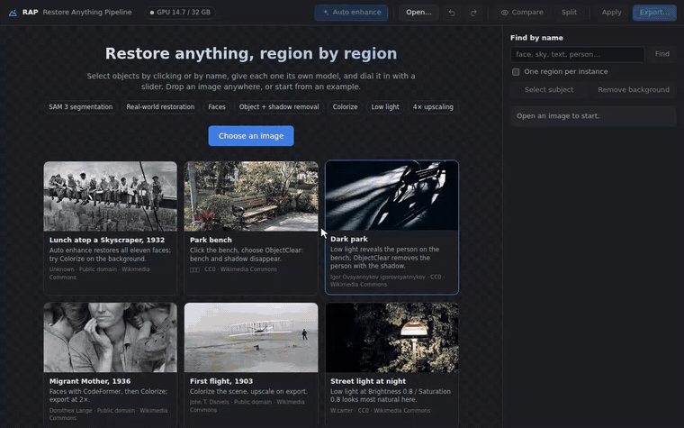
  <br><sub>Select by name, as a subject or with a click, then give each region its own model: restore just the face, blur only what is behind the person, remove a person with their shadow. (Model waits are sped up in all demos.)</sub>
</p>

Most restoration tools treat a photo as one thing. Real photos are not: the
face needs a face model, the sky is noisy, the sign is a JPEG mess, and the
tourist in the back should go. The **Restore Anything Pipeline (RAP)** lets you
select each part with [SAM 3](https://github.com/facebookresearch/sam3) and
give it the right model, at the right strength, while you watch. It runs on
your own GPU as a local web app.

This is the code for our [RAP technical report](https://arxiv.org/abs/2305.13093) (2023),
rebuilt with current models and a full editing interface.

## Highlights

- 🎯 **Select anything.** Click it, drag a box, paint it, or type its name: `face`, `sky`, `text`.
- 🧰 **One model per region.** Restore, denoise, deblur, fix JPEG, restore faces, colorize, brighten, erase, remove with shadows, or generate from a prompt.
- 🎚️ **Instant sliders.** Each model's main control is rendered in advance: drag and see it, or click a preview in the filmstrip.
- 🪄 **One-click help.** Auto enhance restores the background and every face; the app looks at your photo and suggests what to fix.
- 🖼️ **Editor basics built in.** Light and color adjustments per region, crop and straighten, undo/redo for everything, export to PNG/JPEG/WebP with 2×/4× AI upscaling and EXIF kept.
- 💾 **Easy on memory.** Models load the first time you use them and move to CPU memory when idle.

## What's new since the 2023 report

The [technical report](https://arxiv.org/abs/2305.13093) paired Segment
Anything with a controllable restoration model, so each object could get its
own restoration, with several results to choose from. This release keeps that
idea and builds it out:

- **Selection:** SAM 3, with text prompts (`face`, `sky`), boxes, a brush and soft-edged subject mattes on top of clicks.
- **Models:** many models instead of one, covering restoration, faces, colorization, low light, object removal and generative fill, each with continuous controls; adding another takes one small class (see *Adding a restorer*).
- **Choosing a result:** every control is pre-rendered, and a filmstrip previews it, so trying settings is instant.
- **Editing:** light and color adjustments per region, crop and straighten, undo/redo, Apply to chain steps, and export with 2×/4× upscaling.
- **Interface:** a local web app; models load when first needed.

## Demos

### Click, choose, slide

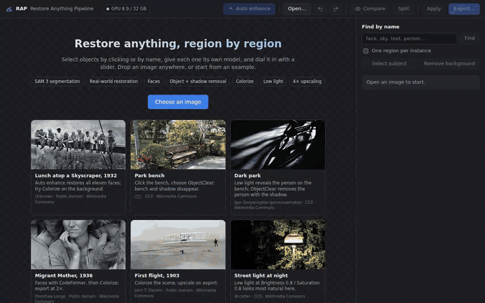

Click the bird, pick **Enhance photo**, and drag **Detail**. Hold <kbd>Space</kbd> to see the original.

### Remove an object together with its shadow

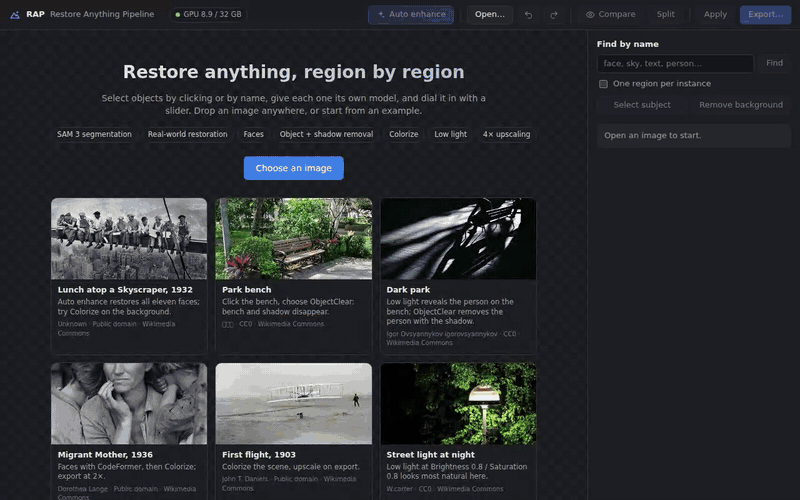

Click the bench and choose **Remove object + shadow**
([ObjectClear](https://github.com/zjx0101/ObjectClear)). Its shadow goes too.

### Find by name, then replace it

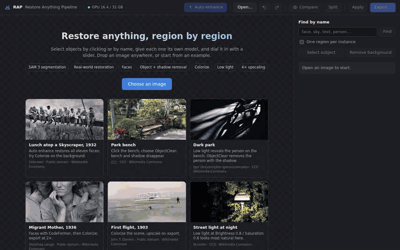

Type `sky`, choose **Replace with…**, describe a sunset
([FLUX.2 [klein]](https://huggingface.co/black-forest-labs/FLUX.2-klein-4B)),
then clean the noisy building with **Remove noise**
([SCUNet](https://github.com/cszn/SCUNet)).

## Results

| | |
|:--:|:--:|
| 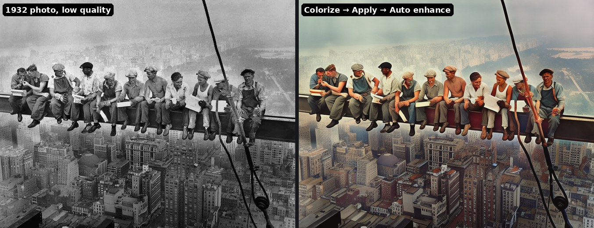 | 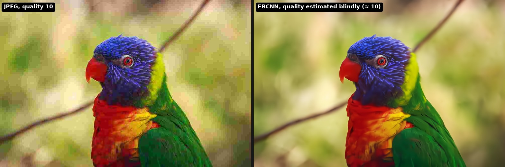 |
| Colorize, apply, then Auto enhance the faces | Heavy JPEG cleaned up; FBCNN finds the quality by itself |
| 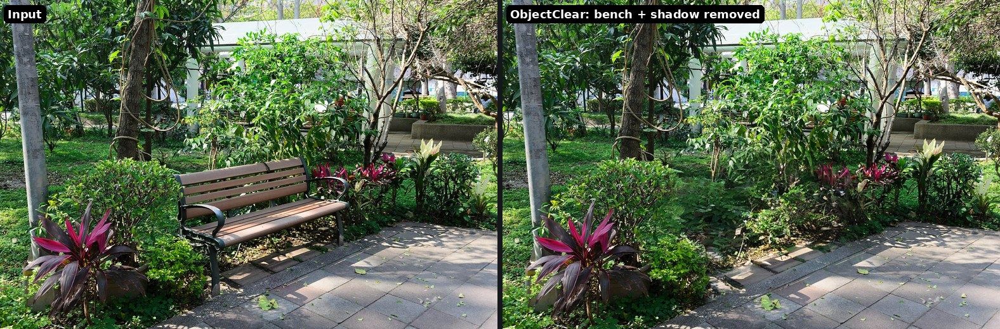 | 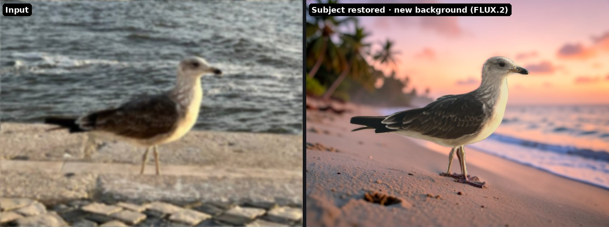 |
| A bench and its shadow removed | A new background from a prompt |
| 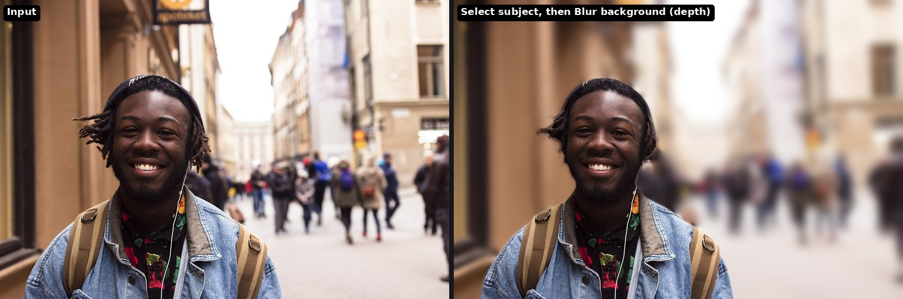 | 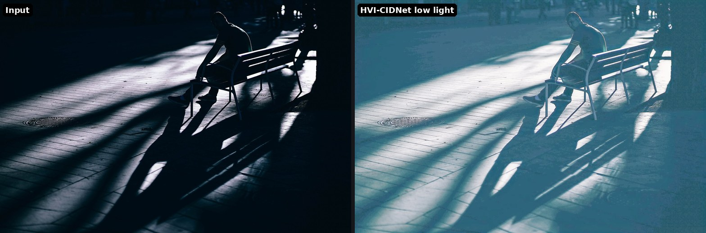 |
| Portrait look: background blurred by estimated depth | Night photo brightened |

## Quick start

**1. Install** (Linux with an NVIDIA GPU, conda):

```bash
git clone https://github.com/eth-siplab/RAP.git
cd RAP
bash scripts/setup.sh          # conda env "rap", third-party code at pinned commits, weights
hf auth login                  # SAM 3 checkpoints are gated on Hugging Face
```

Request access at <https://huggingface.co/facebook/sam3> first. Some models are
downloaded from Hugging Face the first time you use them:
- SD-2.1-base (PiSA-SR's base), from the `sd2-community` mirror; the Stability AI repository was taken down
- ObjectClear, FLUX.2 [klein], DDColor, HVI-CIDNet, BiRefNet (remote code pinned to a revision) and Depth Anything V2

**2. Run:**

```bash
conda activate rap
python -m rap --gpu 0 --port 7860
```

**3. Open** <http://localhost:7860>. On a remote server, forward the port first:

```bash
ssh -N -L 7860:localhost:7860 <user>@<server>
```

Pick one of the example photos on the start page, or drop in your own.

**Hardware.** An NVIDIA GPU with 8 GB or more runs every feature.

| GPU memory | What changes |
|---|---|
| 8–12 GB | Models take turns on the GPU (a few seconds when switching). Generative fill streams its weights from CPU memory: four variants in about 10–20 s. |
| 16–24 GB | Most models stay loaded; switching is rarely needed. |
| 28 GB or more | Everything stays on the GPU, including generative fill. |

The app sizes itself to your GPU: by default about 60% of GPU memory holds
model weights (`--gpu-budget`), and models that don't fit wait in CPU memory,
capped at half of your RAM (32 GB of RAM recommended). If memory still runs
out, it moves other models out, works in smaller batches and retries instead
of failing. `--max-gpu-memory` limits the total on a shared GPU. The table was
measured on a server GPU limited to 8, 12, 16 and 24 GB with that option, where
the full test suite passes; a real consumer card has the same memory limits but
may be slower. 12-megapixel photos work.

**Your work survives a restart.** Sessions are saved to `~/.cache/rap/sessions`
(`--session-dir`; empty keeps them in memory only), and reloading the page
brings yours back. `--cpu-threads` (default 8) caps OpenCV/torch CPU threads,
which matters on busy shared machines.

## Tutorial

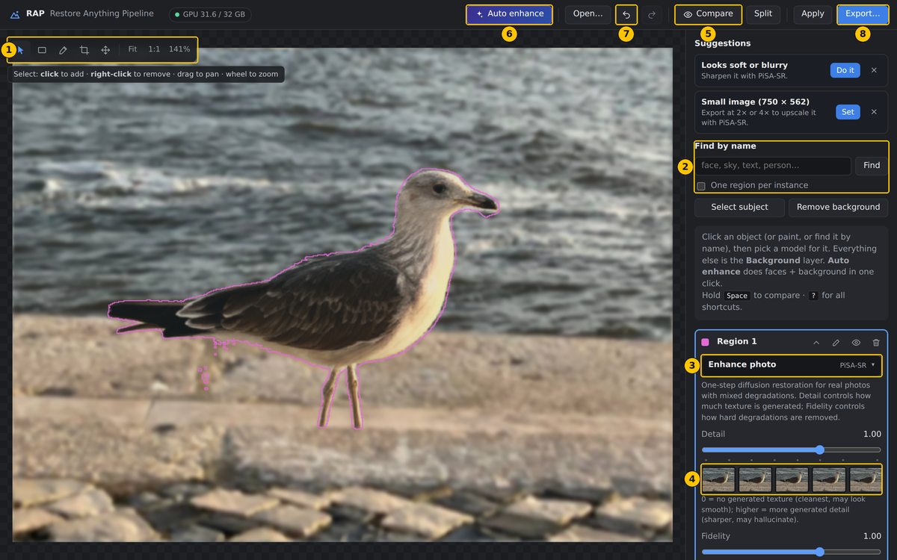

1. **Tools.** Select (<kbd>V</kbd>): click to add, right-click to remove. Box (<kbd>B</kbd>), brush (<kbd>P</kbd>), crop (<kbd>C</kbd>), pan (<kbd>H</kbd>). The line underneath says how the current tool works.
2. **Find by name.** Type a noun such as `face`, `sky` or `text` to select every match at once.
3. **What to do with this region.** Opens the menu of models and effects; the one that suits the region best is marked *Recommended*.
4. **Slider and filmstrip.** The filmstrip shows the main slider at several values; click one to jump there. Releasing the slider renders the exact value.
5. **Compare** (or hold <kbd>Space</kbd>) shows the original; **Split** gives a before/after divider you can drag.
6. **Auto enhance** restores the background with PiSA-SR and every face with CodeFormer.
7. **Undo / redo** work for everything, including Apply and crop.
8. **Export** as PNG, JPEG or WebP: set the quality, resize, or upscale 2×/4× with PiSA-SR.

### Your first edit

1. **Open** a photo: click an example, drop a file anywhere, or paste from the clipboard.
2. **Select** something with a click. Add parts with more clicks and remove parts with right-clicks. Press <kbd>Esc</kbd> (or click beside the image) when the selection is right.
3. **Choose** what to do with it from its card on the right.
4. **Tune** the slider. Each region also has **Adjust** (exposure, contrast, color, clarity, …) and **Strength**, which blends with the original.
5. **Everything else** is the **Background** layer, which can have its own model too.
6. **Export.** Your work also survives a page reload: the address holds your session.

**Tips**
- **Apply** bakes the current result into the photo so you can chain steps: colorize → Apply → restore faces.
- **Select subject** mattes the main subject with soft edges (hair); **Remove background** makes the rest transparent.
- Removals and replacements change the photo itself: the background and the other regions are processed on the edited photo, so removing someone and then brightening everything works in one go. Hold <kbd>Space</kbd> to see the original.
- Click the logo to go back to the start page.

### Keyboard and mouse

| Key | Action |
|---|---|
| <kbd>V</kbd> | Select: click adds, right-click removes |
| <kbd>B</kbd> | Box select |
| <kbd>P</kbd> | Brush: paint adds, right-drag erases; <kbd>[</kbd> <kbd>]</kbd> change the size |
| <kbd>C</kbd> | Crop, rotate, straighten, flip (<kbd>Enter</kbd> applies) |
| <kbd>H</kbd> / middle-drag | Pan; the wheel zooms |
| <kbd>F</kbd> · <kbd>1</kbd> | Fit · actual pixels |
| hold <kbd>Space</kbd> | Compare with the original |
| <kbd>Ctrl</kbd>+<kbd>Z</kbd> / <kbd>Ctrl</kbd>+<kbd>Shift</kbd>+<kbd>Z</kbd> | Undo / redo |
| <kbd>Enter</kbd> / <kbd>Esc</kbd> | Finish the current selection |
| <kbd>Delete</kbd> | Delete the selected region |
| double-click a slider | Reset it |
| <kbd>?</kbd> | All shortcuts, in the app |

## Models

Every model has continuous controls, and the main control is rendered in
advance, so dragging it is instant.

| Model | For | Controls | License |
|---|---|---|---|
| [PiSA-SR](https://github.com/csslc/PiSA-SR) (CVPR 2025) | real photos with mixed degradations; 2×/4× export | Detail, Fidelity | Apache-2.0 |
| [SCUNet](https://github.com/cszn/SCUNet) (MIR 2023) | real noise: phones, high ISO, grainy scans | Texture (PSNR ↔ GAN model) | Apache-2.0 |
| [DRUNet](https://github.com/cszn/DPIR) (TPAMI 2022) | noise at a strength you choose | Noise level σ with a blind estimate | MIT |
| [NAFNet](https://github.com/megvii-research/NAFNet) (ECCV 2022) | camera shake, motion blur | Passes | MIT |
| [FBCNN](https://github.com/jiaxi-jiang/FBCNN) (ICCV 2021) | JPEG artifacts | Quality factor with a blind estimate | Apache-2.0 |
| [CodeFormer](https://github.com/sczhou/CodeFormer) (NeurIPS 2022) | faces | Fidelity | S-Lab (non-commercial) |
| [LaMa](https://github.com/advimman/lama) (WACV 2022) | erasing scratches, text, small objects | Mask expansion | Apache-2.0 |
| [ObjectClear](https://github.com/zjx0101/ObjectClear) (CVPR 2026) | removing objects with their shadows and reflections | Variant, Removal strength | S-Lab (non-commercial) |
| [FLUX.2 [klein] 4B](https://huggingface.co/black-forest-labs/FLUX.2-klein-4B) | generative fill from a prompt; on the background it replaces the background | Variant, Repaint strength | Apache-2.0 |
| [DDColor](https://github.com/piddnad/DDColor) (ICCV 2023) | colorizing black-and-white photos | Color intensity | Apache-2.0 |
| [HVI-CIDNet](https://github.com/Fediory/HVI-CIDNet) (CVPR 2025) | low light | Brightness, Saturation | MIT |

Also used: [SAM 3](https://github.com/facebookresearch/sam3) for selection,
[BiRefNet](https://github.com/ZhengPeng7/BiRefNet) for Select subject, and
[Depth Anything V2 Small](https://huggingface.co/depth-anything/Depth-Anything-V2-Small-hf)
(Apache-2.0) for lens blur.

**Effects per region:** transparent background, solid color, lens blur
(focused on the selected subject), and blur or pixelate for privacy, scaled to
each selected part such as each face.

**Adjust per region:** exposure, contrast, highlights, shadows, whites, blacks,
temperature, tint, vibrance, saturation, clarity, dehaze, sharpen, vignette,
plus **Auto tone** and **Auto color**. These also work without a model, for
example to brighten one backlit face.

## How it stays fast

- Every restorer splits its work into a control-independent `prepare` and a
  cheap `render`. A sweep of the main control renders in one batch, and
  releasing the slider renders the exact value.
- Where the math allows, sweeps are almost free:
  - PiSA-SR's output is linear in its two strengths.
  - FBCNN's condition only enters its decoder.
  - SCUNet's Texture blends two outputs computed once.
  - DDColor and HVI-CIDNet controls act after the network.
- Tonal adjustments run in the browser. Export applies the same pipeline on the
  server (`rap/adjust.py`), matching the preview to within a few 8-bit levels.

## For developers

### Layout

```
rap/
  server.py            FastAPI app: sessions, segmentation, sweeps, history, apply, crop, export
  session.py           regions (binary or soft masks), brush strokes, undo/redo, compositing
  store.py             sessions saved to disk, so a restart keeps everyone's work
  models.py            lazy loading, GPU budget, idle offload
  segment.py           SAM 3 wrapper (points / box / text)
  subject.py           BiRefNet subject matting, Depth Anything V2 depth
  adjust.py            tonal adjustments (reference implementation for export)
  geometry.py          crop / rotate / straighten / flip
  restorers/
    base.py            Restorer interface
    pisasr.py          PiSA-SR on stock diffusers (LoRAs merged by hand) + upscaling
    kair.py            SCUNet and DRUNet denoisers (architectures vendored from KAIR in kair_arch.py)
    nafnet.py          NAFNet motion deblur (architecture vendored in nafnet_arch.py)
    fbcnn.py           FBCNN JPEG artifact removal (tiled for large crops)
    codeformer.py      CodeFormer with batched restore and paste-back
    lama.py            LaMa erase
    objectclear.py     ObjectClear object + effect removal
    genfill.py         FLUX.2 [klein] generative fill
    ddcolor.py         DDColor colorization
    cidnet.py          HVI-CIDNet low light
    effects.py         transparent, solid color, blur, pixelate, lens blur
  static/              single-page UI, no build step
scripts/               setup, weights, example images, README demos
examples/              demo images (see examples/examples.json for sources and licenses)
tests/                 end-to-end checks (API + headless browser)
docs/                  README images and demo GIFs
```

### Adding a restorer

1. Subclass `Restorer`.
2. Declare its `params`. The first param is the one that gets swept.
3. Implement `prepare(img, mask)` and `render` (or `render_many` to batch).
4. Register it in `rap/restorers/__init__.py`.

Flags:
- `needs_mask`, `context`, `blend`: for restorers that edit inside a region themselves.
- `uses_foreground`, `bg_only`, `allow_bg`: for background layers.
- `prompt_hint`: for text-driven restorers.

### Tests

`tests/unit/` needs no GPU and runs on every push (GitHub Actions):
adjustments, crop/rotate, undo/redo and saving/restoring sessions.

```bash
python -m pytest tests/unit
```

`tests/run_all.sh` drives a running server through its API and a headless
browser (Playwright): segmentation, every restorer, adjustments, crop,
undo/redo, export. It reports which scripts failed; each script also prints
what it measured and saves screenshots to `tests/out/`.

```bash
pip install playwright && playwright install chromium
python -m rap --gpu 0                    # in one terminal
PYTHON=python tests/run_all.sh           # in another; RAP_URL=... to test another server
```

### Regenerating the demos

With the server running: `python scripts/record_demos.py` records the clips
(a drawn cursor clicks through the app), `python scripts/make_gifs.py` turns
them into GIFs with the model waits sped up (needs ffmpeg),
`python scripts/make_ui_tour.py` makes the annotated screenshot, and
`python scripts/make_showcase.py` the JPEG and portrait comparisons.

## Citation

```bibtex
@article{jiang2023restore,
  title={Restore anything pipeline: Segment anything meets image restoration},
  author={Jiang, Jiaxi and Holz, Christian},
  journal={arXiv preprint arXiv:2305.13093},
  year={2023}
}
```

## Licenses

The code in this repository is released under the Apache License 2.0 (see
`LICENSE`). Code taken from other projects keeps its original license, noted at
the top of each file; the PiSA-SR wrapper follows the upstream inference code
(Apache-2.0). The crop, undo and
redo icons are adapted from [Lucide](https://lucide.dev) (ISC). Each model keeps
its own license; see the table above. CodeFormer and ObjectClear are
non-commercial. The example photos are public domain or CC0 from Wikimedia
Commons (credits in `examples/examples.json`), except the RAP demo images from 2023.
